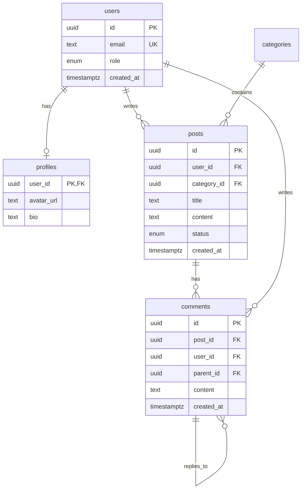

# Database Schema Generator

Genera schemas de base de datos relacionales con PostgreSQL/Supabase, incluyendo diagramas ER, schema.sql ejecutable, y migraciones.

## Usage

```
/database-schema <action> [description]
```

### Actions

```
/database-schema design "blog system with users, posts, comments"
/database-schema analyze "path/to/existing/schema.sql"
/database-schema migrate "add likes table to existing schema"
/database-schema optimize "improve performance of schema"
```

## Examples

### 1. Diseñar Nuevo Schema
```
/database-schema design "e-commerce with products, orders, customers, inventory"
```

**Output**:
- Diagrama ER (texto + Mermaid)
- schema.sql completo ejecutable en Supabase
- Decisiones de diseño explicadas
- RLS policies configuradas
- Indexes optimizados

### 2. Analizar Schema Existente
```
/database-schema analyze "database/schema.sql"
```

**Output**:
- Análisis de normalización
- Issues detectados
- Sugerencias de mejora
- Índices faltantes
- RLS policies recomendadas

### 3. Generar Migración
```
/database-schema migrate "add ratings and reviews for products"
```

**Output**:
- Migración SQL incremental
- Diagrama ER actualizado
- Impacto en tablas existentes
- Plan de rollback
- Testing checklist

### 4. Optimizar Schema
```
/database-schema optimize "posts table has slow queries"
```

**Output**:
- Análisis de performance
- Índices recomendados
- Query optimization
- Partitioning si aplica
- Before/After metrics

## Output Structure

### 1. Diagrama ER

**Formato Texto**:
```
[users]                [profiles]
-------                ----------
PK: id (UUID)      1:1 PK: user_id (UUID, FK → users.id)
    email                  avatar_url
    role                   bio
    created_at             website
    updated_at

    ↓ 1:N

[posts]                [categories]
-------                ------------
PK: id (UUID)      N:1 PK: id (UUID)
FK: user_id            name
FK: category_id        slug
    title              created_at
    content
    status
    created_at
    updated_at

    ↓ 1:N

[comments]
----------
PK: id (UUID)
FK: post_id (UUID → posts.id)
FK: user_id (UUID → users.id)
FK: parent_id (UUID → comments.id, nullable)
    content
    created_at
```

**Formato Mermaid** (para visualización):


### 2. schema.sql

Archivo SQL completo y ejecutable con:

```sql
-- =====================================================
-- Database Schema: Blog System
-- Generated: 2026-02-03
-- PostgreSQL/Supabase Compatible
-- =====================================================

-- Extensions
-- =====================================================
CREATE EXTENSION IF NOT EXISTS "uuid-ossp";
CREATE EXTENSION IF NOT EXISTS "pg_trgm";  -- Text search

-- Custom Types
-- =====================================================
CREATE TYPE user_role AS ENUM ('admin', 'editor', 'user');
CREATE TYPE post_status AS ENUM ('draft', 'published', 'archived');

-- Tables
-- =====================================================

-- users: Application users with authentication
CREATE TABLE users (
  id UUID PRIMARY KEY DEFAULT uuid_generate_v4(),
  email TEXT UNIQUE NOT NULL,
  role user_role NOT NULL DEFAULT 'user',
  created_at TIMESTAMPTZ NOT NULL DEFAULT NOW(),
  updated_at TIMESTAMPTZ NOT NULL DEFAULT NOW()
);

COMMENT ON TABLE users IS 'Application users with authentication via Supabase Auth';
COMMENT ON COLUMN users.role IS 'User role: admin, editor, or user';

-- profiles: Extended user information (1:1 with users)
CREATE TABLE profiles (
  user_id UUID PRIMARY KEY REFERENCES users(id) ON DELETE CASCADE,
  avatar_url TEXT,
  bio TEXT,
  website TEXT,
  updated_at TIMESTAMPTZ NOT NULL DEFAULT NOW()
);

COMMENT ON TABLE profiles IS 'User profiles with optional public information';

-- categories: Post categories
CREATE TABLE categories (
  id UUID PRIMARY KEY DEFAULT uuid_generate_v4(),
  name TEXT UNIQUE NOT NULL,
  slug TEXT UNIQUE NOT NULL,
  description TEXT,
  created_at TIMESTAMPTZ NOT NULL DEFAULT NOW()
);

COMMENT ON TABLE categories IS 'Post categories for organization';

-- posts: User-generated blog posts
CREATE TABLE posts (
  id UUID PRIMARY KEY DEFAULT uuid_generate_v4(),
  user_id UUID NOT NULL REFERENCES users(id) ON DELETE CASCADE,
  category_id UUID REFERENCES categories(id) ON DELETE SET NULL,
  title TEXT NOT NULL,
  slug TEXT UNIQUE NOT NULL,
  content TEXT,
  excerpt TEXT,
  status post_status NOT NULL DEFAULT 'draft',
  published_at TIMESTAMPTZ,
  created_at TIMESTAMPTZ NOT NULL DEFAULT NOW(),
  updated_at TIMESTAMPTZ NOT NULL DEFAULT NOW()
);

COMMENT ON TABLE posts IS 'Blog posts with draft/published workflow';

-- comments: Threaded comments on posts
CREATE TABLE comments (
  id UUID PRIMARY KEY DEFAULT uuid_generate_v4(),
  post_id UUID NOT NULL REFERENCES posts(id) ON DELETE CASCADE,
  user_id UUID NOT NULL REFERENCES users(id) ON DELETE CASCADE,
  parent_id UUID REFERENCES comments(id) ON DELETE CASCADE,
  content TEXT NOT NULL,
  created_at TIMESTAMPTZ NOT NULL DEFAULT NOW(),
  updated_at TIMESTAMPTZ NOT NULL DEFAULT NOW()
);

COMMENT ON TABLE comments IS 'Threaded comments on posts';
COMMENT ON COLUMN comments.parent_id IS 'Parent comment ID for nested replies (NULL for top-level)';

-- Indexes
-- =====================================================

-- users indexes
CREATE INDEX idx_users_email ON users(email);
CREATE INDEX idx_users_role ON users(role);

-- posts indexes
CREATE INDEX idx_posts_user_id ON posts(user_id);
CREATE INDEX idx_posts_category_id ON posts(category_id);
CREATE INDEX idx_posts_status ON posts(status);
CREATE INDEX idx_posts_published_at ON posts(published_at DESC);
CREATE INDEX idx_posts_slug ON posts(slug);

-- Full-text search index
CREATE INDEX idx_posts_search ON posts
  USING GIN (to_tsvector('english', title || ' ' || COALESCE(content, '')));

-- comments indexes
CREATE INDEX idx_comments_post_id ON comments(post_id);
CREATE INDEX idx_comments_user_id ON comments(user_id);
CREATE INDEX idx_comments_parent_id ON comments(parent_id);

-- Functions
-- =====================================================

-- Update updated_at timestamp automatically
CREATE OR REPLACE FUNCTION update_updated_at()
RETURNS TRIGGER AS $$
BEGIN
  NEW.updated_at = NOW();
  RETURN NEW;
END;
$$ LANGUAGE plpgsql;

-- Generate slug from title
CREATE OR REPLACE FUNCTION generate_slug(title TEXT)
RETURNS TEXT AS $$
BEGIN
  RETURN lower(
    regexp_replace(
      regexp_replace(title, '[^a-zA-Z0-9\s-]', '', 'g'),
      '\s+', '-', 'g'
    )
  );
END;
$$ LANGUAGE plpgsql;

-- Triggers
-- =====================================================

-- Auto-update updated_at on users
CREATE TRIGGER set_users_updated_at
  BEFORE UPDATE ON users
  FOR EACH ROW
  EXECUTE FUNCTION update_updated_at();

-- Auto-update updated_at on profiles
CREATE TRIGGER set_profiles_updated_at
  BEFORE UPDATE ON profiles
  FOR EACH ROW
  EXECUTE FUNCTION update_updated_at();

-- Auto-update updated_at on posts
CREATE TRIGGER set_posts_updated_at
  BEFORE UPDATE ON posts
  FOR EACH ROW
  EXECUTE FUNCTION update_updated_at();

-- Auto-update updated_at on comments
CREATE TRIGGER set_comments_updated_at
  BEFORE UPDATE ON comments
  FOR EACH ROW
  EXECUTE FUNCTION update_updated_at();

-- Row Level Security (RLS)
-- =====================================================

-- Enable RLS on all tables
ALTER TABLE users ENABLE ROW LEVEL SECURITY;
ALTER TABLE profiles ENABLE ROW LEVEL SECURITY;
ALTER TABLE categories ENABLE ROW LEVEL SECURITY;
ALTER TABLE posts ENABLE ROW LEVEL SECURITY;
ALTER TABLE comments ENABLE ROW LEVEL SECURITY;

-- users policies
CREATE POLICY "Users can view own user data"
  ON users FOR SELECT
  USING (auth.uid() = id);

CREATE POLICY "Users can update own user data"
  ON users FOR UPDATE
  USING (auth.uid() = id);

-- profiles policies
CREATE POLICY "Anyone can view profiles"
  ON profiles FOR SELECT
  USING (true);

CREATE POLICY "Users can update own profile"
  ON profiles FOR UPDATE
  USING (auth.uid() = user_id);

CREATE POLICY "Users can insert own profile"
  ON profiles FOR INSERT
  WITH CHECK (auth.uid() = user_id);

-- categories policies (public read, admin write)
CREATE POLICY "Anyone can view categories"
  ON categories FOR SELECT
  USING (true);

CREATE POLICY "Only admins can manage categories"
  ON categories FOR ALL
  USING (
    EXISTS (
      SELECT 1 FROM users
      WHERE id = auth.uid() AND role = 'admin'
    )
  );

-- posts policies
CREATE POLICY "Anyone can view published posts"
  ON posts FOR SELECT
  USING (status = 'published' OR auth.uid() = user_id);

CREATE POLICY "Authenticated users can create posts"
  ON posts FOR INSERT
  WITH CHECK (auth.uid() = user_id);

CREATE POLICY "Users can update own posts"
  ON posts FOR UPDATE
  USING (auth.uid() = user_id);

CREATE POLICY "Users can delete own posts"
  ON posts FOR DELETE
  USING (auth.uid() = user_id);

-- comments policies
CREATE POLICY "Anyone can view comments on published posts"
  ON comments FOR SELECT
  USING (
    EXISTS (
      SELECT 1 FROM posts
      WHERE id = comments.post_id AND status = 'published'
    )
  );

CREATE POLICY "Authenticated users can create comments"
  ON comments FOR INSERT
  WITH CHECK (auth.uid() = user_id);

CREATE POLICY "Users can update own comments within 1 hour"
  ON comments FOR UPDATE
  USING (
    auth.uid() = user_id
    AND created_at > NOW() - INTERVAL '1 hour'
  );

CREATE POLICY "Users can delete own comments"
  ON comments FOR DELETE
  USING (auth.uid() = user_id);

-- Initial Data (Optional)
-- =====================================================

-- Insert default categories
INSERT INTO categories (name, slug, description) VALUES
  ('Technology', 'technology', 'Tech news and tutorials'),
  ('Lifestyle', 'lifestyle', 'Lifestyle and wellness'),
  ('Business', 'business', 'Business and entrepreneurship')
ON CONFLICT (slug) DO NOTHING;

-- =====================================================
-- Schema Complete - Ready for Supabase
-- =====================================================
```

### 3. Decisiones de Diseño

Documento explicando:

```markdown
## Decisiones de Diseño: Blog System

### 1. Separación users ↔ profiles (1:1)

**Decisión**: Tablas separadas en lugar de una sola tabla

**Justificación**:
- `users`: Información de autenticación (ligera, frecuentemente consultada)
- `profiles`: Información pública opcional (pesada, menos consultada)
- Mejora performance en queries de auth
- Perfiles opcionales (no todos los users tienen perfil público)

**Trade-off**: Un JOIN extra al mostrar perfil completo

### 2. post_status como ENUM

**Decisión**: ENUM en lugar de tabla de referencia

**Justificación**:
- Solo 3 estados fijos: draft, published, archived
- No requiere metadata adicional
- No cambiará frecuentemente
- Performance: No JOIN necesario

**Alternativa descartada**: Tabla `post_statuses` (over-engineering para caso simple)

### 3. comments.parent_id (Self-referencing)

**Decisión**: Permitir comentarios anidados ilimitados

**Justificación**:
- Flexibilidad para threading
- Simple de implementar
- Recursive queries soportadas en PostgreSQL

**Consideración**: Limitar depth en application layer (ej: max 3 niveles)

### 4. Soft Delete vs Hard Delete

**Decisión**: Hard delete (ON DELETE CASCADE)

**Justificación**:
- Cumplimiento con GDPR (derecho al olvido)
- Schema más simple
- Menos queries complejas

**Alternativa**: Soft delete con `deleted_at` si se necesita audit trail

### 5. Full-text Search con GIN Index

**Decisión**: to_tsvector GIN index en title + content

**Justificación**:
- Búsqueda rápida en inglés
- Nativo de PostgreSQL
- Mejor que LIKE '%term%'

**Query ejemplo**:
```sql
SELECT * FROM posts
WHERE to_tsvector('english', title || ' ' || content) @@ to_tsquery('postgres & database');
```

### 6. RLS Policies

**Decisión**: RLS habilitado en todas las tablas

**Justificación**:
- Seguridad a nivel de base de datos
- Supabase recomienda RLS siempre
- Previene leaks de datos

**Políticas clave**:
- Users solo ven su propia data
- Profiles son públicos
- Posts: solo published son públicos, drafts solo para author
- Comments: solo en posts published

### 7. Indexes Strategy

**Indexes creados**:
- FK indexes (CRÍTICO para JOINs)
- Email unique index
- Status para filtrado
- published_at DESC para ordenamiento
- GIN para full-text search

**No creados**:
- created_at (menos usado para filtrado)
- content (demasiado grande)

### 8. UUID vs BIGSERIAL

**Decisión**: UUID para todas las PKs

**Justificación**:
- No expone volumen de datos (secuencia)
- Distribuido (múltiples servidores)
- Supabase Auth usa UUIDs
- Merge fácil de datasets

**Trade-off**: 16 bytes vs 8 bytes (aceptable)
```

### 4. Migraciones (cuando se modifica schema)

```sql
-- =====================================================
-- Migration: 002_add_likes_to_posts
-- Description: Add likes functionality to posts and comments
-- Date: 2026-02-03
-- =====================================================

BEGIN;

-- Create likes table
CREATE TABLE post_likes (
  user_id UUID NOT NULL REFERENCES users(id) ON DELETE CASCADE,
  post_id UUID NOT NULL REFERENCES posts(id) ON DELETE CASCADE,
  created_at TIMESTAMPTZ NOT NULL DEFAULT NOW(),
  PRIMARY KEY (user_id, post_id)
);

COMMENT ON TABLE post_likes IS 'User likes on posts (one like per user per post)';

-- Create indexes
CREATE INDEX idx_post_likes_post_id ON post_likes(post_id);
CREATE INDEX idx_post_likes_user_id ON post_likes(user_id);

-- Create comment likes table
CREATE TABLE comment_likes (
  user_id UUID NOT NULL REFERENCES users(id) ON DELETE CASCADE,
  comment_id UUID NOT NULL REFERENCES comments(id) ON DELETE CASCADE,
  created_at TIMESTAMPTZ NOT NULL DEFAULT NOW(),
  PRIMARY KEY (user_id, comment_id)
);

COMMENT ON TABLE comment_likes IS 'User likes on comments';

-- Create indexes
CREATE INDEX idx_comment_likes_comment_id ON comment_likes(comment_id);
CREATE INDEX idx_comment_likes_user_id ON comment_likes(user_id);

-- RLS policies
ALTER TABLE post_likes ENABLE ROW LEVEL SECURITY;
ALTER TABLE comment_likes ENABLE ROW LEVEL SECURITY;

CREATE POLICY "Anyone can view post likes"
  ON post_likes FOR SELECT
  USING (true);

CREATE POLICY "Authenticated users can like posts"
  ON post_likes FOR INSERT
  WITH CHECK (auth.uid() = user_id);

CREATE POLICY "Users can unlike posts"
  ON post_likes FOR DELETE
  USING (auth.uid() = user_id);

CREATE POLICY "Anyone can view comment likes"
  ON comment_likes FOR SELECT
  USING (true);

CREATE POLICY "Authenticated users can like comments"
  ON comment_likes FOR INSERT
  WITH CHECK (auth.uid() = user_id);

CREATE POLICY "Users can unlike comments"
  ON comment_likes FOR DELETE
  USING (auth.uid() = user_id);

-- Create helper function for like count
CREATE OR REPLACE FUNCTION get_post_like_count(post_id_param UUID)
RETURNS INTEGER AS $$
BEGIN
  RETURN (SELECT COUNT(*) FROM post_likes WHERE post_id = post_id_param);
END;
$$ LANGUAGE plpgsql;

COMMIT;

-- =====================================================
-- Rollback (if needed)
-- =====================================================
-- BEGIN;
-- DROP TABLE IF EXISTS post_likes CASCADE;
-- DROP TABLE IF EXISTS comment_likes CASCADE;
-- DROP FUNCTION IF EXISTS get_post_like_count(UUID);
-- COMMIT;

-- =====================================================
-- Testing Checklist
-- =====================================================
-- [ ] Insert test like
-- [ ] Verify RLS prevents liking as another user
-- [ ] Verify can't like same post twice (PK constraint)
-- [ ] Verify CASCADE delete when post deleted
-- [ ] Test get_post_like_count() function
```

### 5. Testing & Validation

```sql
-- =====================================================
-- Testing Script for Blog Schema
-- =====================================================

-- 1. Insert test user (via Supabase Auth normally)
INSERT INTO users (id, email, role) VALUES
  ('a0eebc99-9c0b-4ef8-bb6d-6bb9bd380a11', 'test@example.com', 'user');

-- 2. Create profile
INSERT INTO profiles (user_id, bio) VALUES
  ('a0eebc99-9c0b-4ef8-bb6d-6bb9bd380a11', 'Test user bio');

-- 3. Create category
INSERT INTO categories (name, slug) VALUES
  ('Test', 'test');

-- 4. Create post
INSERT INTO posts (user_id, category_id, title, slug, content, status) VALUES
  (
    'a0eebc99-9c0b-4ef8-bb6d-6bb9bd380a11',
    (SELECT id FROM categories WHERE slug = 'test'),
    'Test Post',
    'test-post',
    'This is test content',
    'published'
  );

-- 5. Create comment
INSERT INTO comments (post_id, user_id, content) VALUES
  (
    (SELECT id FROM posts WHERE slug = 'test-post'),
    'a0eebc99-9c0b-4ef8-bb6d-6bb9bd380a11',
    'Test comment'
  );

-- 6. Verify relationships
SELECT
  p.title,
  u.email as author,
  c.name as category,
  COUNT(co.id) as comment_count
FROM posts p
JOIN users u ON p.user_id = u.id
LEFT JOIN categories c ON p.category_id = c.id
LEFT JOIN comments co ON co.post_id = p.id
WHERE p.slug = 'test-post'
GROUP BY p.title, u.email, c.name;

-- 7. Test full-text search
SELECT title, excerpt
FROM posts
WHERE to_tsvector('english', title || ' ' || COALESCE(content, ''))
      @@ to_tsquery('test');

-- 8. Test RLS (should fail if not authenticated as user)
-- SET request.jwt.claims.sub = 'different-user-id';
-- SELECT * FROM posts WHERE status = 'draft';

-- Cleanup
-- DELETE FROM users WHERE email = 'test@example.com';
```

## Workflow

### Paso 1: Entender Requisitos
Antes de generar schema, preguntar:
- ¿Qué entidades existen en el dominio?
- ¿Qué relaciones hay entre ellas?
- ¿Qué queries serán más comunes?
- ¿Qué datos son sensibles (RLS necesario)?
- ¿Necesitas multi-tenancy?
- ¿Soft delete o hard delete?

### Paso 2: Diseñar ER
- Identificar entidades
- Definir atributos
- Establecer relaciones (1:1, 1:N, N:M)
- Normalizar (usualmente 3NF)
- Identificar PKs y FKs

### Paso 3: Generar SQL
- Estructura: Extensions → Types → Tables → Indexes → Functions → Triggers → RLS
- Naming conventions consistentes
- Comentarios en tablas/columnas importantes
- Timestamps (created_at, updated_at) en todas las tablas

### Paso 4: Optimizar
- Indexes en FKs (siempre)
- Indexes en columnas WHERE frecuentes
- GIN index para búsqueda de texto
- Partial indexes si aplica

### Paso 5: Seguridad (RLS)
- Habilitar RLS en todas las tablas
- Políticas restrictivas por defecto
- Public read solo en datos públicos
- Auth check en todas las modificaciones

### Paso 6: Testing
- Script de test data
- Verificar constraints
- Probar RLS policies
- Verificar CASCADE deletes

## Supabase-Specific Features

### Realtime Subscriptions
```sql
-- Habilitar realtime en tabla
ALTER PUBLICATION supabase_realtime ADD TABLE posts;
ALTER PUBLICATION supabase_realtime ADD TABLE comments;
```

**Client-side (JavaScript)**:
```javascript
// Subscribe to new posts
const channel = supabase
  .channel('posts')
  .on('postgres_changes', {
    event: 'INSERT',
    schema: 'public',
    table: 'posts'
  }, (payload) => {
    console.log('New post:', payload.new);
  })
  .subscribe();
```

### Storage Integration
```sql
-- Storage bucket policies
CREATE POLICY "Users can upload own avatars"
  ON storage.objects FOR INSERT
  WITH CHECK (
    bucket_id = 'avatars' AND
    auth.uid()::text = (storage.foldername(name))[1]
  );

CREATE POLICY "Anyone can view avatars"
  ON storage.objects FOR SELECT
  USING (bucket_id = 'avatars');
```

### Edge Functions Integration
```sql
-- Function para llamar desde Edge Function
CREATE OR REPLACE FUNCTION get_user_stats(user_id_param UUID)
RETURNS JSON AS $$
BEGIN
  RETURN json_build_object(
    'post_count', (SELECT COUNT(*) FROM posts WHERE user_id = user_id_param),
    'comment_count', (SELECT COUNT(*) FROM comments WHERE user_id = user_id_param),
    'total_likes', (SELECT COUNT(*) FROM post_likes WHERE user_id = user_id_param)
  );
END;
$$ LANGUAGE plpgsql SECURITY DEFINER;
```

## Common Patterns

### Multi-tenancy
```sql
-- Tenant isolation
CREATE TABLE tenants (
  id UUID PRIMARY KEY DEFAULT uuid_generate_v4(),
  name TEXT NOT NULL,
  created_at TIMESTAMPTZ DEFAULT NOW()
);

CREATE TABLE users (
  id UUID PRIMARY KEY DEFAULT uuid_generate_v4(),
  tenant_id UUID NOT NULL REFERENCES tenants(id),
  email TEXT NOT NULL,
  UNIQUE(tenant_id, email)  -- Email único por tenant
);

-- RLS para aislar tenants
CREATE POLICY "Users can only see own tenant data"
  ON users FOR SELECT
  USING (
    tenant_id = (
      SELECT tenant_id FROM users WHERE id = auth.uid()
    )
  );
```

### Audit Trail
```sql
CREATE TABLE audit_log (
  id BIGSERIAL PRIMARY KEY,
  table_name TEXT NOT NULL,
  record_id UUID NOT NULL,
  operation TEXT NOT NULL,  -- INSERT, UPDATE, DELETE
  old_data JSONB,
  new_data JSONB,
  user_id UUID,
  created_at TIMESTAMPTZ DEFAULT NOW()
);

CREATE OR REPLACE FUNCTION audit_trigger()
RETURNS TRIGGER AS $$
BEGIN
  INSERT INTO audit_log (table_name, record_id, operation, old_data, new_data, user_id)
  VALUES (
    TG_TABLE_NAME,
    COALESCE(NEW.id, OLD.id),
    TG_OP,
    CASE WHEN TG_OP IN ('UPDATE', 'DELETE') THEN row_to_json(OLD) END,
    CASE WHEN TG_OP IN ('INSERT', 'UPDATE') THEN row_to_json(NEW) END,
    auth.uid()
  );
  RETURN COALESCE(NEW, OLD);
END;
$$ LANGUAGE plpgsql SECURITY DEFINER;

-- Apply to tables
CREATE TRIGGER audit_posts
  AFTER INSERT OR UPDATE OR DELETE ON posts
  FOR EACH ROW EXECUTE FUNCTION audit_trigger();
```

### Soft Delete
```sql
ALTER TABLE posts ADD COLUMN deleted_at TIMESTAMPTZ;

-- View de posts activos
CREATE VIEW active_posts AS
  SELECT * FROM posts WHERE deleted_at IS NULL;

-- Función soft delete
CREATE OR REPLACE FUNCTION soft_delete_post(post_id_param UUID)
RETURNS VOID AS $$
BEGIN
  UPDATE posts SET deleted_at = NOW() WHERE id = post_id_param;
END;
$$ LANGUAGE plpgsql;

-- RLS solo muestra posts activos
CREATE POLICY "Only show non-deleted posts"
  ON posts FOR SELECT
  USING (deleted_at IS NULL);
```

## Output Files

El skill genera estos archivos:

```
database/
├── schema.sql              # Schema completo ejecutable
├── migrations/
│   ├── 001_initial.sql
│   ├── 002_add_likes.sql
│   └── 003_add_tags.sql
├── diagrams/
│   ├── er-diagram.md       # Diagrama ER en texto
│   └── er-diagram.mmd      # Mermaid diagram
├── docs/
│   ├── design-decisions.md
│   └── testing-guide.md
└── seeds/
    └── test-data.sql       # Datos de prueba
```

## Integration with Database Architect Agent

Este skill trabaja en conjunto con el **Database Architect** agent:

- **Agent**: Consultas, decisiones arquitectónicas, optimizaciones, explicaciones
- **Skill**: Generación de archivos concretos (SQL, diagramas, migraciones)

**Workflow recomendado**:
1. Invocar skill para generar schema inicial
2. Consultar agent para decisiones complejas
3. Usar skill para generar migraciones
4. Consultar agent para optimización
5. Usar skill para generar scripts finales

## Referencias

### Supabase
- [Supabase Database](https://supabase.com/docs/guides/database)
- [Row Level Security](https://supabase.com/docs/guides/auth/row-level-security)
- [Database Functions](https://supabase.com/docs/guides/database/functions)

### PostgreSQL
- [PostgreSQL Documentation](https://www.postgresql.org/docs/)
- [Data Types](https://www.postgresql.org/docs/current/datatype.html)
- [Indexes](https://www.postgresql.org/docs/current/indexes.html)

### Tools
- [dbdiagram.io](https://dbdiagram.io/) - Visual ER diagrams
- [Mermaid ER Diagrams](https://mermaid.js.org/syntax/entityRelationshipDiagram.html)

### Recursos Internos
- `agents/data/database-architect.md` - Database Architect agent
- `skills/data/sql-optimization/SKILL.md` - SQL optimization skill
